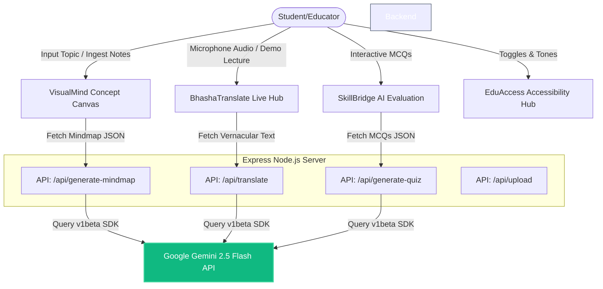

# AcademixIQ: Multi-Modal AI Classroom Accessibility Platform
### Technical Documentation & Architecture Specification

---

## 1. Project Overview & Problem Statement

In India, classroom instruction is highly unified, but students learn at vastly different speeds and come from diverse linguistic, physical, and cognitive backgrounds. Traditional teaching methods fail to address:
1. **Cognitive Hurdles**: Students with ADHD, dyslexia, or high-distraction profiles struggle with long walls of text.
2. **Language Barriers**: English-medium instruction alienates students more comfortable with their vernacular tongue.
3. **Mastery Gaps**: Static worksheets fail to pinpoint *exactly which concept* a student is struggling with, resulting in cumulative learning deficits.

**AcademixIQ** is a comprehensive, multi-modal educational platform that leverages Generative AI (Google Gemini) to adapt classrooms to each student's unique needs in real-time. It transforms lessons into visual mind maps, translates voice instructions into regional Indian languages, and diagnoses concept gaps to update the learning roadmaps dynamically.

---

## 2. Platform Subsystems

AcademixIQ is divided into four integrated modern core components:



### A. VisualMind Concept Canvas
* **Purpose**: Generates interactive conceptual graphs using a node-link model.
* **Tech Stack**: React canvas rendering with calculated node coordinates.
* **AI Logic**: Queries the Gemini API with structured prompts to return clean JSON graph structures. It breaks topics into `root`, `subtopic`, and `detail` nodes, each carrying a concise summary, key questions, and flashcard objects.
* **Dynamic Node Expansion**: Allows students to select any concept node and request detailed sub-nodes, merging them on the fly.

### B. BhashaTranslate Live Hub
* **Purpose**: Captures classroom voice instructions and translates them to regional Indian languages in real-time.
* **Tech Stack**: Web Speech API (`SpeechRecognition` listener) for capture; Speech Synthesis (`SpeechSynthesisUtterance`) for text-to-speech output.
* **Supported Languages**: Hindi, Tamil, Telugu, Bengali, Marathi, and Kannada.
* **AI Logic**: Generative translation prompt preserving academic scientific terms phonetically so they remain understandable in context.

### C. SkillBridge Adaptive Evaluations
* **Purpose**: Evaluates student understanding dynamically and identifies specific learning gaps.
* **Logic**: Generates a 5-question multiple choice quiz on the active concept. When the quiz is completed:
  1. The student's incorrect responses are mapped to the respective concept tags.
  2. The frontend marks the nodes as `good` (mastery, green) or `weak` (gap, orange) in the visual canvas.
  3. A personalized **Adaptive Study Checklist** is compiled, directing the student exactly which nodes to review.

### D. EduAccess Accessibility Panel
* **Purpose**: Tailors the interface for neurodiverse and visually impaired students.
* **Features**:
  * **Dyslexia Mode**: Applies an open-dyslexic style layout with high-readability spacing and heavy letter bottoms.
  * **ADHD Focus Ruler**: Dimmer panels screen off the surrounding noise, leaving a mouse-guided highlighting ruler.
  * **Contrast & Color Filters**: Real-time CSS matrix color filter injection (Protanopia, Deuteranopia, Tritanopia, High Contrast) using inline SVG filters.
  * **Voice Commands Navigation**: Speech-activated controls to open quizzes, change themes, or select nodes.

---

## 3. Technology Stack & Scalability

| Layer | Technology | Rationale |
|---|---|---|
| **Frontend** | React, Vite, TypeScript, Lucide Icons | Rapid HMR, type-safe development, lightweight vector graphics. |
| **Styling** | Vanilla CSS, TailwindCSS, HSL variables | Maximum layout customization, modern translucent glassmorphism theme. |
| **Backend** | Node.js, Express, Multer | Event-driven architecture, fast request-response cycles, streams. |
| **AI Engine** | Google Gemini 2.5 Flash SDK (`@google/generative-ai`) | Ultra-fast execution times, robust JSON schemas support. |

### Technical Feasibility & Production Roadmap
1. **Local Sandbox Prototype Mode**: To ensure judges have a zero-install, zero-setup testing experience, the system has built-in keyword routers matching **Photosynthesis**, **Quantum Computing**, and **Neural Networks** to local mock structures.
2. **API Keys / Security**: API Keys configured by developers are sent using secure, encrypted headers (`x-gemini-key`). In production, this shifts to a secure OAuth 2 session flow or backend cloud secret vault.
3. **Scalability**: By utilizing the lightweight `gemini-2.5-flash` model, token costs are minimized, and throughput remains high, enabling dozens of concurrent classroom transcriptions.

---

## 4. Installation & Execution Guide

Follow these steps to run the AcademixIQ platform locally:

### Prerequisites
* **Node.js** (v18 or higher) installed on your system.

### Step 1: Install Dependencies
Run from the project root:
```bash
# Install root package-lock modules
npm install

# Install backend dependencies
cd backend
npm install

# Install frontend dependencies
cd ../frontend
npm install
```

### Step 2: Configure Environment (Optional for live mode)
Create a `.env` file inside the `backend` folder:
```env
GEMINI_API_KEY=your_google_studio_api_key
PORT=5000
```
*Note: If no API key is provided, the server operates in **Prototype Simulation Mode** using the pre-loaded modules.*

### Step 3: Run the Services
Run the following commands in separate terminals:

**Start Backend API Server**:
```bash
cd backend
npm run dev
```
*Server runs on [http://localhost:5000](http://localhost:5000)*

**Start Frontend Development Server**:
```bash
cd frontend
npm run dev
```
*Vite web application runs on [http://localhost:5173](http://localhost:5173)*

### Step 4: Access the Dashboard
Open Google Chrome or Microsoft Edge and navigate to `http://localhost:5173`.
To unlock the developer bypass settings, double-click the **`PROTOTYPE v2`** version badge in the upper navigation header.
